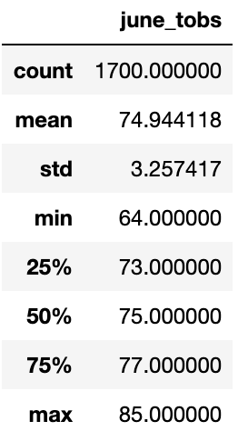
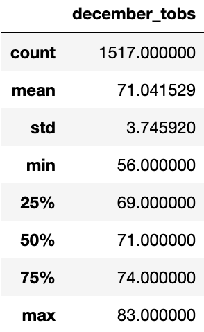

# Surf's Up: A Weather Analysis

## Overview

The purpose of this analysis is to determine the suitability of the weather in Oahu, Hawaii for opening a surfing and ice cream business. Oahu temperature data was used to examine trends during the months of June and December across several years (2010-2017 for June, 2010-2016 for December). Statistical summaries for the data of both months were produced.

## Results

- Both June and December appear to have temperature observations that are normally distributed; both months have a mean temperature that is within 0.1 degrees of the median.
- Temperature observations for both months are also very consistent; in both months, the 25% percentile and 75% percentile are well within 1 standard deviation from the mean, i.e. for both months, at least 50% of temperature observations are within 1 standard deviation of the mean.
- As may be expected, December is cooler than June, with a mean that 3 degrees below June, and a mininum that sinks to 56 degrees.

Statistical summary for June temperature observations (2010-2017)

Statistical summary for December temperature observations (2010-2016)

## Summary

According to this analysis, the temperature is not only suitable for a surf/ice cream shop, but reliably so. During the months of June and December, the temperature stays in a comfortable range for surfing. Even at the minimum temperatures recorded for December, surfing is still viable.

Further analysis could consider:
- comparing temperature observations of different years to search for any climate trends in Junes and Decembers across time.
- analyzing precipitation data of June and December.
- finding modes for the temperature data to further describe the data's central tendency.
